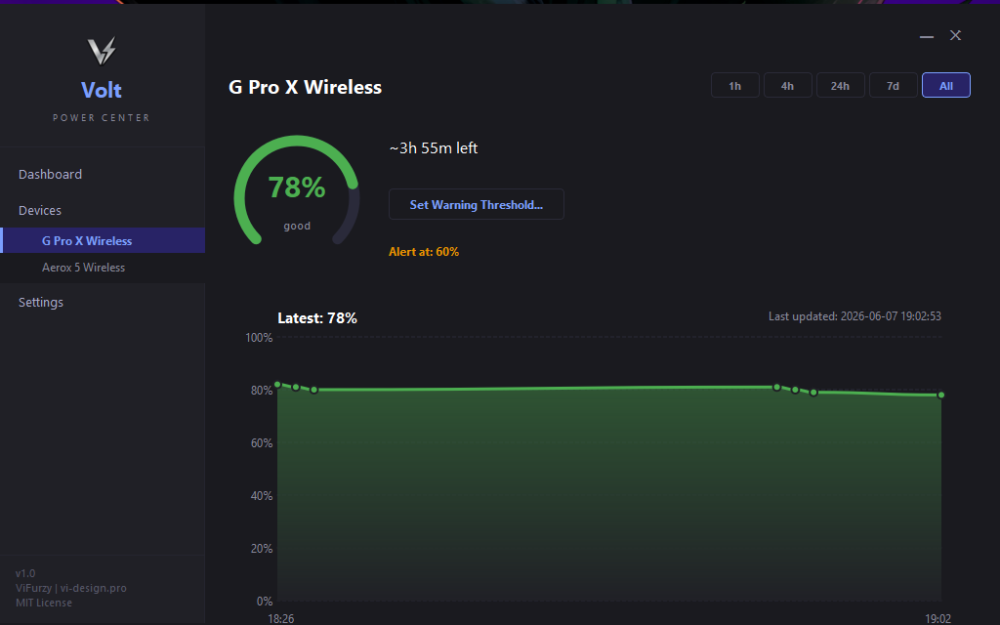
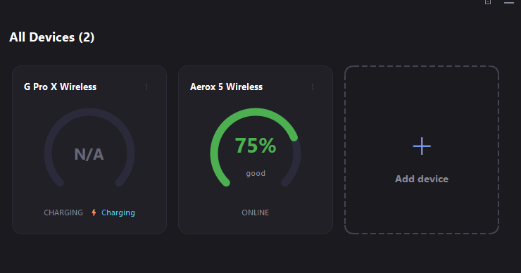
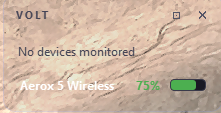
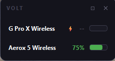

# VOLT | POWER CENTER

[](https://www.python.org/)
[](https://doc.qt.io/qtforpython-6/)
[](https://opensource.org/licenses/MIT)

**Volt** (Power Center) is a premium, lightweight, dark-mode desktop utility for Windows 11 designed to monitor the battery levels of your wireless gaming peripherals and Bluetooth LE devices. 

Unlike official manufacturer suites, Volt operates with zero bloated processes, consumes minimal system resources, and queries device status using pure asynchronous HID/BLE protocols.

---

## 🚀 Quick Download & Install (Customers / Users)

If you are a user and just want to install the application on Windows, you do **not** need to set up Python or compile the source code:

1. **Download the Installer**: Click the link below to download the latest setup program directly:
   👉 **[Download Volt_Setup.exe (v0.5.0)](https://github.com/ViFurzy/Volt/raw/main/dist/Volt_Setup.exe)** 👈
2. **Run the Installer**: Double-click `Volt_Setup.exe` in your Downloads folder and run the setup.
3. **Configure Installation**: Select optional configurations such as creating a desktop shortcut or registering Volt to launch at Windows startup.
4. **Launch**: Open Volt from your Start Menu, Desktop, or system tray.

*Alternatively, you can browse all compiled files in the [dist/ folder](https://github.com/ViFurzy/Volt/tree/main/dist) or check the [Releases Page](https://github.com/ViFurzy/Volt/releases).*

---


## Key Features

* **Sleek Premium Dashboard**: Beautiful dark-mode interface with progress rings, real-time connectivity status, and dynamic charging indicators.
* **Low-Latency Polling**: High-performance device status query loop running on an asynchronous background thread.
* **Dynamic Charging Animations**: Visual sweeping animations for charging gauges and progress bars.
* **Smart Polling Throttling**: Automatically adjusts battery querying frequency during charging (every 2 minutes) to prevent reading elevated charging voltages, while maintaining instant reaction to connection/charging plug events.
* **Compact Mode (Floating Widget)**: A minimalist, draggable, always-on-top window that displays only active devices.
* **Flexible Compact Layouts**: Toggle between a streamlined **Horizontal** (single-row) or stacked **Vertical** bar layout.
* **Beside Display Mode**: Allow the compact widget to display simultaneously beside the main application window instead of replacing it.
* **Custom Low-Battery Thresholds**: Set personalized warning thresholds per device to change battery gauge colors from normal (green) to warning (amber) and critical (red).
* **System Tray & Toast Notifications**: Minimize to the tray on close and receive native Windows Toast notifications when device battery drops below thresholds.
* **Launch on Startup**: Optional registration in the Windows Registry (`HKCU\Run`) to launch automatically at login.

---

## Screenshots

### Main Dashboard
Sleek dark-mode interface displaying all active and offline devices with threshold-colored battery indicators.


### Settings Page
Manage close behaviors, startup options, transparency, widget always-on-top state, beside mode, and widget layouts.


### Compact Mode Widget (Horizontal & Vertical)
Minimalist floating overlays showing active devices in your preferred layout.
| Horizontal Layout | Vertical Layout |
| :---: | :---: |
|  |  |

---

## Tech Stack & Dependencies

* **Core Language**: Python 3.12+
* **GUI & Widget Toolkit**: PySide6 (Qt 6)
* **HID Communication**: `hidapi` (via `hid` wrapper) for low-level peripheral polling.
* **Bluetooth LE**: `bleak` for scanning and query characteristics of wireless BLE peripherals.
* **Notifications**: `Windows-Toasts` for native Windows 11 toast notifications.

---

## Installation & Setup

### Running from Source

1. **Clone the Repository**:
   ```bash
   git clone https://github.com/ViFurzy/Volt.git
   cd Volt
   ```

2. **Set up a Virtual Environment**:
   ```bash
   python -m venv .venv
   .venv\Scripts\activate
   ```

3. **Install Dependencies**:
   ```bash
   pip install -r requirements.txt
   ```

4. **Launch the Application**:
   ```bash
   python -m src
   ```

### Building the Standalone Executable

To compile Volt into a standalone executable:
```bash
python scripts/build.py
```
This builds the application using **PyInstaller** and places the output in the `dist/Volt/` directory.

### Compiling the Installer (Inno Setup)

If you have Inno Setup installed, you can compile `scripts/installer.iss` to produce `dist/Volt_Setup.exe` for streamlined installation:
```bash
"%LOCALAPPDATA%\Programs\Inno Setup 6\ISCC.exe" scripts/installer.iss
```

---

## Architectural Invariants (Developer Guidelines)

If you wish to contribute or modify Volt, please adhere to these core architectural invariants:

1. **COM MTA Mode Execution**: `sys.coinit_flags = 0` must remain the **very first line** in `src/__main__.py`, before any imports. The `bleak` WinRT backend requires COM MTA mode; otherwise, Bleak will hang silently forever when initiating connections.
2. **Thread Safety**: All low-level HID/BLE I/O operations must run exclusively on the asyncio background thread. The Qt GUI runs on the main thread and communicates with the background worker thread via a thread-safe `queue.Queue`.
3. **HID Interfaces**: Select vendor-specific HID interfaces using `usage_page=0xFF00`, never by primary interface (like mouse/keyboard). Windows locks standard mouse/keyboard interfaces, causing calls to fail with `Access Denied`.
4. **HID++ Discoverability**: Discover feature indices dynamically at runtime via the Root feature (`0x0000`) rather than hardcoding them, as firmware updates frequently reassign feature indexes.
